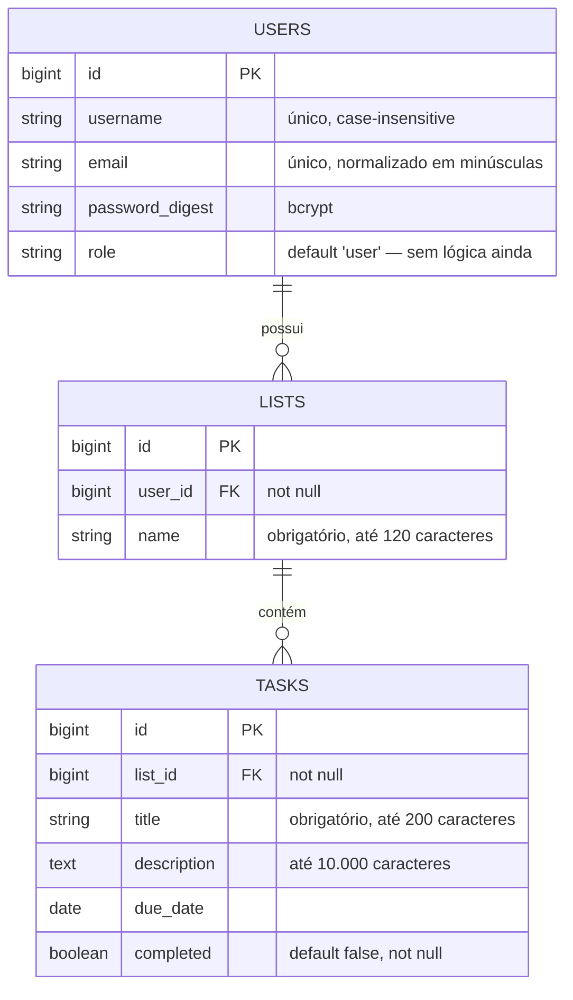

# To-do list

Aplicação de listas de tarefas em Ruby on Rails: **monólito full-stack** com
Postgres, views ERB e Hotwire (Turbo + Stimulus), estilizado com Tailwind.
Autenticação por sessão nativa do Rails — sem JWT e sem API JSON. Todo o
ambiente de desenvolvimento roda em Docker, e o desenvolvimento é guiado por
TDD.

Cada usuário tem suas listas; cada lista tem suas tarefas. Nada é compartilhado
entre contas, e **toda** leitura ou escrita é escopada no usuário da sessão.

---

## Sumário

1. [O que a aplicação faz](#1-o-que-a-aplicação-faz)
2. [Stack](#2-stack)
3. [Como rodar](#3-como-rodar)
4. [Comandos do dia a dia](#4-comandos-do-dia-a-dia)
5. [Variáveis de ambiente](#5-variáveis-de-ambiente)
6. [Estrutura do projeto](#6-estrutura-do-projeto)
7. [Modelo de dados](#7-modelo-de-dados)
8. [Rotas](#8-rotas)
9. [Autenticação e autorização](#9-autenticação-e-autorização)
10. [Segurança](#10-segurança)
11. [Front-end](#11-front-end)
12. [Testes](#12-testes)
13. [Qualidade e análise estática](#13-qualidade-e-análise-estática)
14. [CI/CD e deploy](#14-cicd-e-deploy)
15. [Armadilhas conhecidas deste ambiente](#15-armadilhas-conhecidas-deste-ambiente)
16. [Documentação complementar](#16-documentação-complementar)

---

## 1. O que a aplicação faz

| Área | Funcionalidade |
|---|---|
| Conta | Cadastro (`username`, e-mail, senha + confirmação), login, logout |
| Listas | Criar (popup), renomear, excluir, ver progresso (`7 de 10 concluídas`) |
| Tarefas | Criar com título, descrição e prazo (popup); editar; concluir pela caixa de seleção; excluir; tela própria por tarefa |
| Estados | Estado vazio dedicado para "nenhuma lista" e "nenhuma tarefa"; prazo vencido destacado |
| Acessibilidade | Skip link, `<dialog>` nativo (foco preso, `Esc` fecha), tema claro/escuro por `prefers-color-scheme` |

Excluir uma lista exclui as tarefas dela (`dependent: :destroy`); excluir um
usuário exclui listas e tarefas em cascata.

---

## 2. Stack

| Camada | Escolha | Versão |
|---|---|---|
| Linguagem | Ruby | 3.4.9 |
| Framework | Rails (monólito full-stack) | 8.1.3 |
| Banco | PostgreSQL | 17 (alpine) |
| Servidor | Puma | 8.0.2 |
| Autenticação | `bcrypt` + `has_secure_password` + sessão em cookie | 3.1.22 |
| Assets | Propshaft + importmap-rails | 1.3.2 / 2.2.3 |
| Interatividade | Turbo + Stimulus | 2.0.23 / 1.3.4 |
| CSS | Tailwind CSS (via `tailwindcss-rails`) | 4.6.0 |
| Testes | RSpec, FactoryBot, Faker, Shoulda Matchers, SimpleCov | rspec-rails 8.0.4 |
| Testes de sistema | Capybara + Cuprite (Chromium headless) | 3.40 / 0.17 |
| Análise estática | RuboCop (rails-omakase), Brakeman, bundler-audit | — |
| Ambiente | Docker + Docker Compose | — |

**Sem Node no runtime.** O importmap serve os módulos ES direto do Propshaft e o
`tailwindcss-rails` usa o binário standalone — não há `package.json`, bundler de
JS nem `node_modules`.

**Sem webfont externa.** A pilha de fontes é a do sistema: o container não tem
rede garantida e a CSP não libera CDN.

> Detalhamento de cada dependência, e do que foi deixado de fora e por quê, em
> [`docs/STACK.md`](docs/STACK.md).

---

## 3. Como rodar

**Pré-requisitos:** Docker e Docker Compose. Mais nada — Ruby, Postgres e
Chromium vivem dentro dos containers.

```bash
cp .env.example .env      # ajuste POSTGRES_PASSWORD e SECRET_KEY_BASE
docker compose build app
docker compose up -d
docker compose run --rm app bin/rails db:prepare
docker compose run --rm app bin/rails tailwindcss:build
```

A aplicação responde em **http://localhost:3000**. O Postgres fica exposto na
porta **5433** do host (para não colidir com uma instalação nativa na 5432).

Gerando segredos para o `.env`:

```bash
openssl rand -hex 64      # SECRET_KEY_BASE
openssl rand -hex 24      # POSTGRES_PASSWORD
```

> ⚠️ **O `tailwindcss:build` não é opcional num clone novo.**
> `app/assets/builds/` é gitignored: sem esse passo o Propshaft não acha o
> `tailwind` referenciado no layout e a aplicação sobe sem estilo nenhum — e
> todo spec de sistema quebra. Repita o comando sempre que mexer no CSS ou usar
> uma classe nova numa view: o container roda só o servidor, não há watcher.

---

## 4. Comandos do dia a dia

Tudo roda dentro do container. `docker compose run --rm app` cria um container
efêmero; `docker compose exec app` reaproveita o que já está de pé.

```bash
docker compose up -d                                   # sobe banco e aplicação
docker compose logs -f app                             # logs da aplicação
docker compose down                                    # derruba tudo (pgdata sobrevive)

docker compose run --rm app bundle exec rspec          # suíte inteira
docker compose run --rm app bundle exec rspec spec/models   # só os rápidos
docker compose run --rm app bundle exec rubocop        # lint
docker compose run --rm app bin/brakeman --no-pager    # análise estática de segurança
docker compose run --rm app bin/bundler-audit check --update   # CVE nas gems

docker compose run --rm app bin/rails db:migrate       # aplica migrations
docker compose run --rm app bin/rails console          # console
docker compose run --rm app bin/rails tailwindcss:build    # recompila o CSS
```

Depois de mexer no `Gemfile`: `docker compose build app`.

> **A saída do `rspec` fica bufferizada** quando o comando roda pelo PowerShell.
> Para acompanhar ao vivo, redirecione para um arquivo no bind mount
> (`... > /rails/suite.log 2>&1`) e leia o arquivo pelo host.

---

## 5. Variáveis de ambiente

O `.env` **não é versionado**; `.env.example` é o modelo versionado — mantenha
os dois em sincronia. O `compose.yaml` falha na hora se as obrigatórias
faltarem, em vez de subir com um default silencioso.

| Variável | Obrigatória | Usada por | Para quê |
|---|---|---|---|
| `POSTGRES_USER` | ✅ | db, app | Usuário do Postgres |
| `POSTGRES_PASSWORD` | ✅ | db, app | Senha do Postgres |
| `POSTGRES_DB` | ✅ | db, app | Banco de desenvolvimento |
| `POSTGRES_DB_TEST` | — (`to_do_list_test`) | app | Banco da suíte |
| `SECRET_KEY_BASE` | ✅ | app | Assina o cookie de sessão |
| `DB_HOST_PORT` | — (`5433`) | db | Porta do Postgres no host |
| `APP_HOST_PORT` | — (`3000`) | app | Porta da aplicação no host |
| `APP_HOST` | ✅ **em produção** | app | Alimenta `config.hosts`; sem ela a aplicação não sobe |

**`SECRET_KEY_BASE` assina o cookie de sessão: trocá-lo desloga todo mundo.**

**Não use `DATABASE_URL`.** O Rails a mescla sobre a configuração do ambiente
atual — com ela definida, a suíte de teste apontaria para o banco de
desenvolvimento e o `db:test:prepare` o apagaria. Por isso `config/database.yml`
lê variáveis discretas (`DB_HOST`, `DB_USERNAME`, `DB_NAME_TEST`…), montadas
pelo `compose.yaml` a partir do `.env`.

---

## 6. Estrutura do projeto

```
app/
  controllers/
    application_controller.rb          require_login, current_user, 404 genérico
    concerns/session_management.rb     reset_session + carimbo de expiração
    sessions_controller.rb             login / logout (+ rate limit)
    users_controller.rb                cadastro (+ rate limit)
    lists_controller.rb                CRUD de listas, escopado no dono
    tasks_controller.rb                CRUD de tarefas, aninhado em lista
  models/
    user.rb                            has_secure_password, e-mail normalizado,
                                       senha mínima de 8 e lista de senhas comuns
    list.rb                            belongs_to :user, has_many :tasks
    task.rb                            belongs_to :list, delegate :user
  views/
    layouts/application.html.erb       nav, flash, favicon, importmap, Tailwind
    lists/    index · show · edit      listas, tarefas da lista, renomear
    tasks/    show · edit              tela da tarefa, edição
    sessions/new    users/new          login, cadastro
    shared/                            _modal, _errors, _icon, _flash, not_found…
  javascript/controllers/
    dialog_controller.js               abre/fecha o popup de criação
    autosubmit_controller.js           envia o formulário no change (sem onchange inline)
  assets/tailwind/application.css      tokens de tema + componentes (.btn, .field, .card…)

config/
  initializers/content_security_policy.rb   CSP com nonce por sessão
  initializers/session_store.rb             cookie httponly, SameSite=Lax, 2 semanas
  initializers/permissions_policy.rb        Permissions-Policy por default_headers
  database.yml                              variáveis discretas, nunca DATABASE_URL

db/migrate/                            3 migrations (users, lists, tasks)
public/icon.svg · icon.png             ícone da aba (favicon e apple-touch-icon)
spec/                                  models · requests · system (ver seção 12)
docs/                                  ARQUITETURA.md · STACK.md · SEGURANCA.md
.github/workflows/                     ci.yml · cd_main.yml
compose.yaml · Dockerfile.dev          ambiente de desenvolvimento e teste
Dockerfile                             imagem de produção (multi-stage, não-root)
```

---

## 7. Modelo de dados



### A ausência que importa: `Task` não tem `user_id`

A posse de uma tarefa é derivada de `list.user_id` (`delegate :user, to: :list`).
Denormalizar o dono criaria duas fontes de verdade que podem divergir — e a
divergência seria exatamente um furo de autorização.

**Integridade no banco, não só no Rails:** chaves estrangeiras em
`lists.user_id` e `tasks.list_id`, `NOT NULL` nas colunas obrigatórias, índice
único em `users.email` e índice único funcional em `lower(username)`. As
validações do Active Record são cortesia de UX; a fonte de verdade é o índice —
tanto que `UsersController#create` trata `RecordNotUnique` para que a corrida
entre dois cadastros simultâneos vire 422, não 500.

---

## 8. Rotas

| Verbo | Caminho | Ação | Auth |
|---|---|---|---|
| GET / POST | `/signup` | `users#new` / `#create` | pública |
| GET / POST | `/login` | `sessions#new` / `#create` | pública |
| DELETE | `/logout` | `sessions#destroy` | exige login |
| GET | `/lists` (root) | `lists#index` | login |
| POST | `/lists` | `lists#create` | login |
| GET | `/lists/:id` | `lists#show` | login + posse |
| GET / PATCH | `/lists/:id/edit` · `/lists/:id` | `lists#edit` / `#update` | login + posse |
| DELETE | `/lists/:id` | `lists#destroy` | login + posse |
| GET / POST / PATCH / DELETE | `/lists/:list_id/tasks/...` | `tasks#*` | login + posse da lista |
| GET | `/up` | health check | pública |

Tarefas são **aninhadas em listas** de propósito: garante que a lista sempre
venha da rota, já validada contra o `current_user`.

O `before_action :require_login` mora no `ApplicationController` — a proteção é
**opt-out**, não opt-in. Só `sessions#new/create` e `users#new/create` fazem
`skip_before_action`; um controller novo nasce protegido.

Depois de marcar uma tarefa como concluída, o destino vem do parâmetro
`return_to`, que só aceita **o token fixo `"task"`** — nunca uma URL enviada
pelo cliente, que seria redirecionamento aberto.

---

## 9. Autenticação e autorização

### Autenticação

Sessão nativa do Rails em cookie assinado (`cookie_store`), `httponly`,
`SameSite=Lax`, `Secure` em produção, validade de 2 semanas. A senha é guardada
como digest bcrypt via `has_secure_password`.

O `expire_after` do cookie é uma instrução ao navegador; a validade que vale é
conferida no servidor a partir do carimbo `session[:created_at]`, assinado junto
com o resto do cookie (`SessionManagement#session_expired?`). Sessão sem carimbo
também expira — falhar fechado obriga um login novo em vez de conceder validade
eterna a quem chegou primeiro.

**Limitação aceita conscientemente:** o cookie store guarda o estado inteiramente
no cliente, então o logout é imediato no navegador do usuário mas não *revoga*
nada — um cookie copiado antes continuaria autenticando até expirar. Revogar
exigiria estado no servidor (tabela de sessões ou `session_token`); para o risco
desta aplicação, a migration não se paga.

### As invariantes de autorização

Cada uma tem spec dedicado. Quebrar qualquer uma é **regressão de segurança**,
não mudança de comportamento:

- **A posse vem sempre da sessão.** Toda leitura/escrita passa por
  `current_user.lists`.
- **Nunca confie em id vindo do payload.** `user_id` fica fora dos params
  permitidos de `List`, `list_id` fora dos de `Task`, `role` fora dos de `User`.
- **Recurso alheio responde 404, nunca 403.** Um 403 confirmaria que aquele id
  existe e permitiria enumerar os recursos dos outros usuários — as duas
  respostas são idênticas byte a byte.
- **Login não revela quais e-mails existem.** Senha errada e e-mail inexistente
  devolvem a mesma mensagem *e* gastam o mesmo tempo de bcrypt
  (`SessionsController::DUMMY_PASSWORD_DIGEST`) — mensagem igual sem custo igual
  ainda vaza por timing.
- **`reset_session` antes de gravar o `user_id`**, contra session fixation.
- **CSRF ligada**, é a defesa principal agora que a autenticação anda em cookie.
- **Prefetch do Turbo não encosta na sessão** (ver seção 11).

---

## 10. Segurança

A aplicação passou por uma auditoria completa — controllers, models, views,
configuração, sessão, schema, Docker, workflows e dependências. As **11 falhas
encontradas foram corrigidas**, cada uma com spec de regressão.
[`docs/SEGURANCA.md`](docs/SEGURANCA.md) mantém o registro de cada uma: o que
era, por que era falha e o que a fechou.

**O que está ativo hoje:**

| Defesa | Onde |
|---|---|
| Rate limiting: 10 logins / 3 min e 5 cadastros / hora, por IP | `sessions_controller.rb`, `users_controller.rb` |
| Content-Security-Policy sem `unsafe-inline` nem `unsafe-eval`, com nonce por sessão | `config/initializers/content_security_policy.rb` |
| `Permissions-Policy` negando câmera, microfone, geolocalização, pagamento e USB | `config/initializers/permissions_policy.rb` |
| Expiração de sessão conferida no servidor | `concerns/session_management.rb` |
| `config.hosts` preenchido em produção (com exceção só para o `/up`) | `config/environments/production.rb` |
| HSTS e cookies `Secure` via `force_ssl` | `config/environments/production.rb` |
| Senha: mínimo de 8 caracteres + recusa de senhas comuns | `app/models/user.rb` |
| Limites de tamanho em `name`, `title` e `description` | `app/models/list.rb`, `app/models/task.rb` |
| Workflows com `permissions: contents: read` e actions fixadas por SHA | `.github/workflows/` |
| Host key SSH do deploy fixada em secret (sem TOFU) | `.github/workflows/cd_main.yml` |
| Zero `html_safe`/`raw`/`render inline` em `app/`; zero interpolação em SQL | — |

O nonce da CSP é **por sessão**, não por requisição: um nonce sorteado a cada
render faria a resposta de recurso alheio diferir da de recurso inexistente e
devolveria justamente o canal de enumeração que o 404 genérico existe para
fechar.

**Pendências operacionais** (não de código, registradas em `docs/SEGURANCA.md`):
preencher o secret `DOKKU_HOST_KEY` — sem ele o próximo deploy em `master` falha
de propósito — e trocar o `memory_store` do rate limit por um store compartilhado
se a aplicação passar de um processo Puma.

### Regras não negociáveis do repositório

- Nunca commitar `.env`, `config/master.key` ou qualquer credencial.
- Nunca dar push direto em `main`/`master`; sempre trabalhar em branch.
- Nunca rodar migrations destrutivas sem confirmação explícita.
- Todo dado vindo do usuário é não confiável: Strong Parameters e queries
  parametrizadas.

---

## 11. Front-end

Hotwire sobre views ERB — nenhuma SPA, nenhum estado de UI duplicado no cliente.

**Criar é sempre por popup.** Lista e tarefa usam o mesmo `shared/_modal`, um
`<dialog>` nativo dirigido pelo `dialog_controller.js`. O motivo é de uso: um
campo de texto solto no topo da página é lido como barra de pesquisa, não como
"crie algo aqui"; e o popup dá espaço para pedir título, descrição e prazo.
**Editar continua sendo página**, com URL própria — é uma tarefa deliberada, que
precisa poder ser recarregada e compartilhada.

O popup **reabre sozinho quando a validação falha**: o servidor re-renderiza a
página inteira com 422, o Turbo troca o `body` e o partial recebe
`open: @registro.errors.any?`. Sem isso o popup voltaria fechado, escondendo o
erro e o que a pessoa digitou.

**Estilo por tokens semânticos.** As views citam papéis (`bg-surface`,
`text-fg-muted`, `.btn .btn-primary`, `.field`, `.card`, `.badge`), nunca cores
literais. O tema escuro sai inteiro de `prefers-color-scheme` trocando os
valores em `app/assets/tailwind/application.css` — sem JS, sem toggle, sem
tocar em nenhuma view.

**Ícones** ficam todos em `shared/_icon.html.erb`, como markup literal — nunca
`raw`/`html_safe`. O ícone da aba (`public/icon.svg` + `public/icon.png`) repete
a mesma marca do cabeçalho: o quadrado na cor de acento com o check. Os arquivos
ficam em `public/` porque o navegador os busca por um caminho fixo, sem digest e
sem passar pelo Propshaft; o SVG atende todo navegador atual e o PNG cobre o
Safari e a tela de início do iOS.

**O prefetch do Turbo está desligado** no `<body>`
(`data-turbo-prefetch="false"`). O Turbo busca o link no hover e reaproveita
aquela resposta na navegação seguinte — uma página capturada antes de um flash
existir apareceria sem ele, e isso o servidor não tem como corrigir. Do lado do
servidor, `ApplicationController#isolate_prefetch_from_session` continua valendo
como defesa em profundidade: um prefetch não consome o flash nem responde com
`Set-Cookie`. Não reative sem reler a seção 5.5 de
[`docs/ARQUITETURA.md`](docs/ARQUITETURA.md).

---

## 12. Testes

**TDD é obrigatório neste projeto:** nada de código de produção em `app/` sem um
teste falhando antes. A escolha do tipo de teste não é estilo — é o que o teste
consegue provar.

| Camada | Onde | Cobre |
|---|---|---|
| Model | `spec/models/` | Validações, associações, `has_secure_password`, defaults, unicidade case-insensitive |
| Sistema | `spec/system/` | Fluxos de usuário em Chrome headless real: cadastro, login/logout, CRUD de listas e tarefas, popup, estados vazios |
| Request | `spec/requests/` | Cenários que um navegador não produz de forma confiável |

Os specs de request cobrem exatamente o que o Capybara não alcança:

- `authorization_spec.rb` — forjar `user_id`/`list_id`/`role` no corpo da
  requisição e a indistinguibilidade entre recurso alheio e inexistente;
- `flash_spec.rb` — o prefetch não consome nem sobrescreve a sessão;
- `content_security_policy_spec.rb`, `permissions_policy_spec.rb`,
  `favicon_spec.rb` — cabeçalhos e o que o layout declara;
- `rate_limit_spec.rb`, `session_expiration_spec.rb`, `signup_race_spec.rb` —
  anti-abuso, ciclo de vida da sessão e a corrida de unicidade.

> **Por que segurança não vira spec de sistema:** um formulário não tem campo
> `list_id`. Converter esses cenários para Capybara faria o teste passar sem
> provar nada.

### Duas regras que evitam teste intermitente

**Nunca use `expect { click_button ... }.to change(Model, :count)` em spec de
sistema.** O Turbo envia o formulário por `fetch`, então não existe navegação
para o Capybara esperar: o clique retorna na hora e o matcher `change` — que não
tem retry — lê o contador antes de o POST terminar. Sincronize primeiro numa
asserção de tela e só depois consulte o banco:

```ruby
click_button "Criar lista"

expect(page).to have_content("Mercado")   # esta é a que espera
expect(owner.lists.count).to eq(1)
```

A mesma regra vale para `task.reload` logo após um `click_button`.

**A primeira rodada depois de subir o Docker pode falhar** em specs de sistema de
login (container frio). Aqueça antes de tratar o resultado como baseline.

### Rodando

```bash
docker compose run --rm app bundle exec rspec              # tudo
docker compose run --rm app bundle exec rspec spec/models  # só os rápidos
docker compose run --rm app bundle exec rspec spec/requests/authorization_spec.rb:42
```

Cobertura via SimpleCov em `coverage/index.html`.

---

## 13. Qualidade e análise estática

```bash
docker compose run --rm app bundle exec rubocop            # rails-omakase
docker compose run --rm app bin/brakeman --no-pager        # vulnerabilidades no código
docker compose run --rm app bin/bundler-audit check --update   # CVE nas gems
```

O `--update` do `bundler-audit` baixa a `ruby-advisory-db` antes de checar. Sem
ele o scan usa a cópia congelada dentro da gem e fica cego para toda CVE
publicada depois daquele release. Ele atualiza o banco de advisories, **não** as
gems — nada ali escreve no `Gemfile.lock`.

Convenções: nomes de métodos e variáveis em inglês, comentários podem ser em
português; controllers finos, regra de negócio em models ou concerns; nada de
teste sem asserção; `schema.rb` nunca editado à mão — sempre via migration.

---

## 14. CI/CD e deploy

### Fluxo de branches

```
feature → develop → master
```

`develop` e `master` exigem os checks **test**, **lint** e **scan_ruby**. O nome
do job `test` no `ci.yml` é o nome do status check exigido na proteção da
branch: renomear um sem renomear o outro trava o PR — ou, pior, libera o merge
sem exigir nada.

### CI — `.github/workflows/ci.yml`

Dispara em todo pull request e em push na `master`. Três jobs:

| Job | O que faz |
|---|---|
| `scan_ruby` | Brakeman + `bundler-audit check --update` |
| `lint` | RuboCop (com cache) |
| `test` | Postgres 17 de serviço, `db:test:prepare`, `tailwindcss:build`, suíte RSpec completa em Chrome de verdade; guarda screenshots dos specs de sistema que falharem |

Todas as actions são fixadas por SHA e os workflows declaram
`permissions: contents: read`.

### CD — `.github/workflows/cd_main.yml`

O gatilho **não** é push: é a conclusão bem-sucedida do workflow "CI" na
`master`, então nada é publicado sem passar pela CI. O checkout usa o SHA exato
da execução aprovada (em `workflow_run` o padrão traria o HEAD da branch, que
pode já ter avançado). O deploy é um `git push` para o Dokku, autenticado por
chave SSH, com `known_hosts` vindo do secret `DOKKU_HOST_KEY` — sem fallback
para `ssh-keyscan`, que seria trust-on-first-use a cada execução.

### Produção

Droplet única com Dokku, provisionada por `.github/setup-dokku.sh` (idempotente):
cria o app, o Postgres, o link com `--alias DB`, deriva as variáveis discretas a
partir da URL, gera o `SECRET_KEY_BASE` se ainda não existir e emite o
certificado Let's Encrypt. A imagem é o `Dockerfile` multi-stage da raiz e roda
como usuário não-root.

Secrets necessários no repositório: `DOKKU_HOST`, `DOKKU_SSH_PRIVATE_KEY`,
`DOKKU_HOST_KEY`.

---

## 15. Armadilhas conhecidas deste ambiente

Já resolvidas — não reintroduza:

- **bootsnap foi removido de propósito.** Seu cache nativo não abre arquivos sob
  um caminho com acento (`Área de Trabalho`) no Windows e quebra o boot.
- **Binstubs em `bin/` precisam de shebang `#!/usr/bin/env ruby`.** Gerados no
  Windows saem com `ruby.exe`, que não existe no container Linux. O
  `.gitattributes` força LF em `bin/*`, `*.sh` e `Dockerfile*`.
- **`spec/rails_helper.rb` força `ENV['RAILS_ENV'] = 'test'`** com atribuição
  incondicional. Com `||=` o `RAILS_ENV=development` do container venceria e a
  suíte rodaria contra o banco de desenvolvimento.
- **Não monte volume nomeado em `/usr/local/bundle`.** Ele sombreia as gems da
  imagem, e um `docker compose build` depois de mexer no `Gemfile` não teria
  efeito nenhum.
- **`.modal-panel` precisa de `m-auto`.** O preflight do Tailwind zera a margem
  de tudo, inclusive o `margin: auto` que centraliza um `<dialog>` modal.
- **As opções do Cuprite vão no `driven_by(options:)`,** não em
  `Capybara.register_driver`: no Rails 8.1 o `driven_by` re-registra o driver e
  descarta o registro manual. Sem `--no-sandbox` o Chrome não sobe como root.

---

## 16. Documentação complementar

| Documento | O que traz |
|---|---|
| [`docs/ARQUITETURA.md`](docs/ARQUITETURA.md) | Decisões de arquitetura com o porquê de cada uma, invariantes de autorização em detalhe, diagramas de camadas e de fluxo |
| [`docs/STACK.md`](docs/STACK.md) | Inventário completo da stack, versão a versão, e o que foi deixado de fora |
| [`docs/SEGURANCA.md`](docs/SEGURANCA.md) | Auditoria de segurança: as 11 falhas, a correção de cada uma e o spec que prova |
| [`CLAUDE.md`](CLAUDE.md) | Instruções operacionais para trabalho assistido por IA neste repositório |

### Por que monólito, e quando reconsiderar

O projeto chegou a ser API-only com JWT, mas o requisito de `Authorization:
Bearer` não era real — o cliente especificou apenas "Ruby on Rails". Cookie
`httponly` não é roubável por XSS e custa menos código.

Só volte a considerar API-only se aparecer um consumidor que **não compartilha
cookie com o servidor**: app mobile nativo, parceiro externo ou múltiplos
front-ends.
