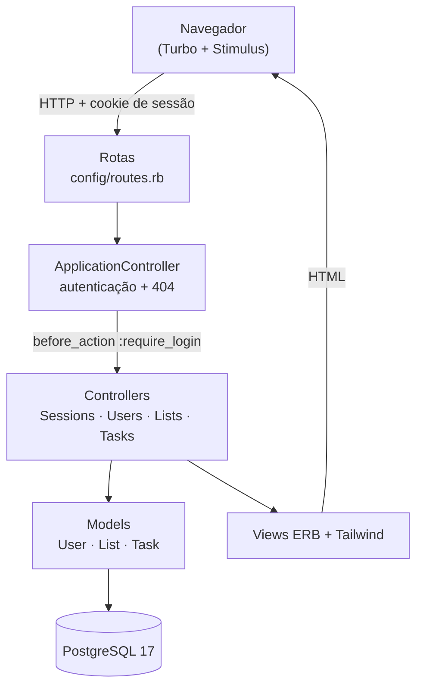
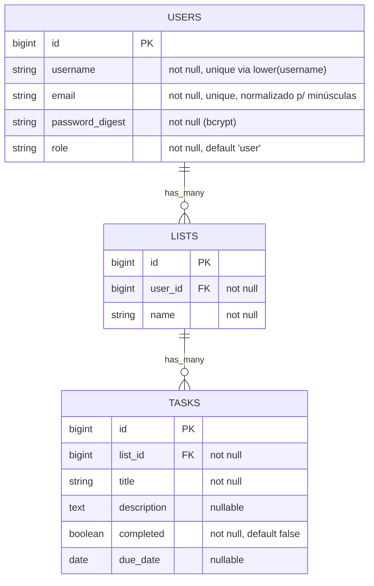
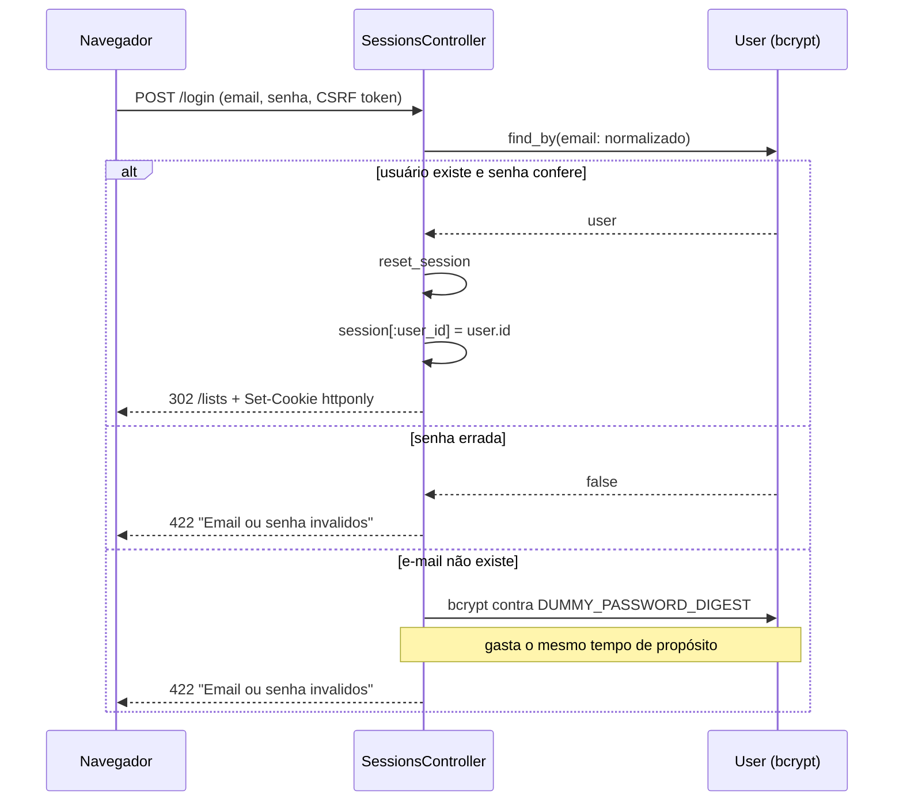
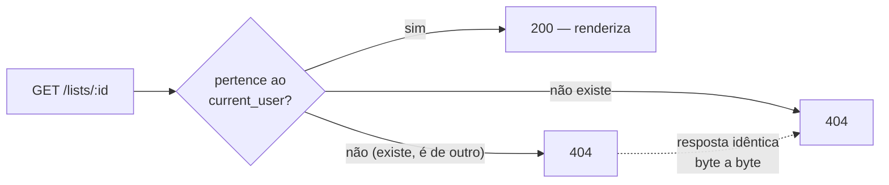
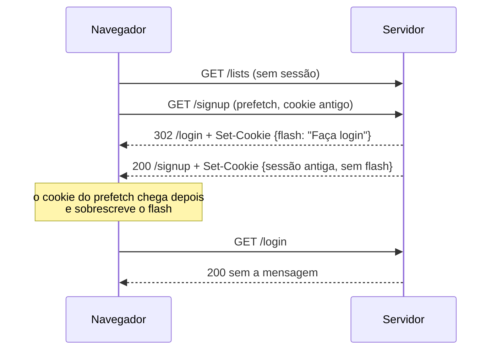
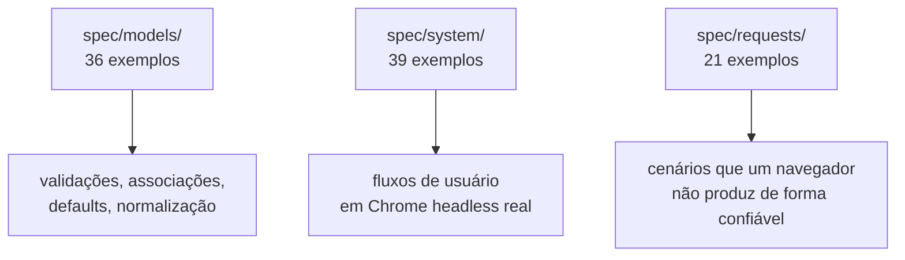
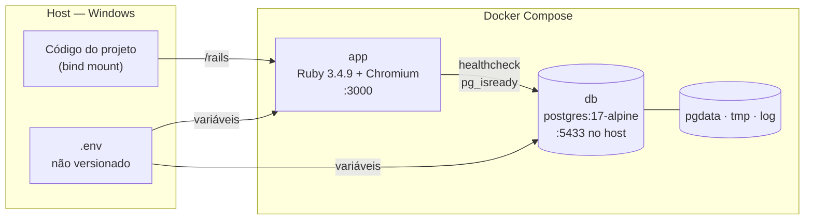

# Arquitetura

To-do list em Ruby on Rails. Documento de referência para quem for mexer no
projeto: o que existe, por que está assim, e quais regras não podem ser
quebradas sem quebrar segurança.

Para regras de trabalho no dia a dia (comandos, ciclo TDD, convenções), veja
[`../CLAUDE.md`](../CLAUDE.md).

Este documento descreve o que **está** protegido. O que ainda **não está** —
auditoria de vulnerabilidades em aberto, com a correção de cada uma — fica em
[`SEGURANCA.md`](SEGURANCA.md).

O inventário das dependências — cada peça da stack, versão, papel e por que ela
e não outra — fica em [`STACK.md`](STACK.md).

---

## 1. A decisão central: monólito

O sistema é um **monólito full-stack**. O Rails responde HTML, e o Hotwire dá
interatividade sem SPA. Não existe API JSON nem cliente separado.

*A stack é Ruby on Rails*. Nesse cenário o
monólito é o padrão, e sair dele exige justificativa — API-only adicionaria uma
segunda stack (SPA), com CORS, segundo deploy e o problema de onde guardar o
token no navegador. Nada disso foi contratado.

O projeto **chegou a ser API-only com JWT** e foi migrado de volta. O requisito
de `Authorization: Bearer` veio do enunciado, não de uma necessidade real.

> **Quando reabrir essa discussão:** só se aparecer um consumidor que não
> compartilha cookie com o servidor — app mobile nativo, integração de
> terceiros, ou mais de um front-end. Enquanto for "uma aplicação web e ponto",
> monólito.

---

## 2. Camadas



Regra de corte: **controllers finos**. Eles carregam o recurso já escopado pelo
dono, aplicam Strong Parameters e renderizam. Validação e regra de negócio ficam
no model; comportamento compartilhado entre controllers vira concern.

---

## 3. Modelo de dados



### A ausência que importa: `Task` não tem `user_id`

Essa é a decisão de modelagem que mais afeta o código. A posse de uma tarefa é
**sempre derivada** de `task.list.user_id`.

Um `user_id` denormalizado em `tasks` seria mais rápido de consultar, mas criaria
duas fontes de verdade para "de quem é esta tarefa". Bastaria um caminho de
código gravar um valor divergente para abrir um furo de autorização silencioso.

Há um teste que trava isso:

```ruby
it "nao tem user_id proprio: a posse vem sempre da lista" do
  expect(Task.column_names).not_to include("user_id")
end
```

### Índices e integridade

| Objeto | Por quê |
|---|---|
| `index_users_on_email` (unique) | E-mail é normalizado para minúsculas antes de salvar, então o índice simples já garante unicidade real |
| `index_users_on_lower_username` (unique, funcional) | Username é guardado como digitado. Sem índice em `lower(username)`, duas requisições simultâneas criariam `ana` e `Ana` driblando a validação do model |
| FK `lists.user_id → users.id` | Impede lista órfã no nível do banco |
| FK `tasks.list_id → lists.id` | Idem para tarefas |

`dependent: :destroy` nas associações cuida da cascata no nível da aplicação;
as FKs são a rede de proteção abaixo dela.

---

## 4. Autenticação

Sessão nativa do Rails: cookie assinado e criptografado, `httponly`,
`samesite=lax`. Sem JWT, sem token no `localStorage`.



Dois detalhes do diagrama que são defesas, não enfeite:

**`reset_session` antes de gravar o `user_id`** (concern `SessionManagement`).
Descarta o identificador de sessão que o visitante trazia. Sem isso, quem
conseguisse plantar um id de sessão no navegador da vítima continuaria dono
daquela sessão depois do login — *session fixation*. É um risco que só existe
porque a autenticação anda em cookie; não existia na versão com JWT.

**bcrypt no caminho do e-mail inexistente.** A mensagem já era idêntica nos dois
casos, mas o tempo não era: sem usuário, nenhum bcrypt rodava e a resposta
voltava quase instantânea. Cronometrando, dava para descobrir quais e-mails
estão cadastrados. `SessionsController::DUMMY_PASSWORD_DIGEST` iguala o custo.

---

## 5. Autorização — as invariantes

Esta é a seção mais importante do documento. Cada item tem spec dedicado.
**Quebrar qualquer um é regressão de segurança, não mudança de comportamento.**

As invariantes abaixo cobrem autorização. As lacunas fora dela — rate limiting,
CSP, expiração de sessão, endurecimento do CI/CD — estão catalogadas em
[`SEGURANCA.md`](SEGURANCA.md).

### 5.1 A posse vem da sessão, nunca do payload

Todo acesso passa por `current_user.lists`. Não existe consulta a `List.find` ou
`Task.find` global em nenhum controller.

```ruby
# ListsController
def set_list
  @list = current_user.lists.find(params[:id])
end

# TasksController — a lista vem da ROTA, já escopada no dono
def set_list
  @list = current_user.lists.find(params[:list_id])
end

def set_task
  @task = @list.tasks.find(params[:id])
end
```

### 5.2 Ids forjados no corpo são ignorados

Strong Parameters **não permitem** os campos que definem posse:

| Recurso | Permitido | Deliberadamente fora |
|---|---|---|
| `User` | `username`, `email`, `password` | `role` — senão o cliente escolhe o próprio papel |
| `List` | `name` | `user_id` — o dono vem da sessão |
| `Task` | `title`, `description`, `completed`, `due_date` | `list_id` — a lista vem da rota |

Se o `list_id` do corpo fosse aceito, daria para criar uma tarefa dentro da lista
de outro usuário, ou mover a sua tarefa para fora do seu escopo.

### 5.3 Recurso alheio responde 404, nunca 403



Um 403 confirmaria que aquele id existe. Bastaria varrer `/lists/1`, `/lists/2`…
para mapear quantas listas os outros usuários têm. O escopo em
`current_user.lists` faz o Active Record levantar `RecordNotFound` nos dois
casos, e o `rescue_from` no `ApplicationController` renderiza a mesma página.

O spec compara **status e corpo**, não só o status — um teste que checasse
apenas `have_http_status(:not_found)` passaria mesmo se o corpo vazasse a
diferença.

### 5.4 CSRF

Volta automaticamente com `config.api_only = false` e é a defesa principal agora
que a autenticação anda em cookie. Um `POST` sem `authenticity_token` recebe
422. Os helpers de formulário do Rails incluem o token sozinhos.

### 5.5 Prefetch não encosta na sessão

O Turbo dispara um `GET` do link assim que o mouse passa por cima dele, **em
paralelo** com a navegação real. Essa requisição carrega o cookie de sessão como
qualquer outra — e é aí que ela estraga as coisas:



Um prefetch **não é uma visita**: a resposta pode ser descartada sem nunca ser
exibida. Logo ele não pode ter efeito colateral na sessão. O
`ApplicationController` neutraliza os dois caminhos:

```ruby
def isolate_prefetch_from_session
  return unless request.headers["X-Sec-Purpose"] == "prefetch"

  flash.keep                              # não consome a mensagem
  request.session_options[:skip] = true   # não responde com Set-Cookie
end
```

Só o `flash.keep` **não basta** — ele resolve o prefetch que leu a mensagem, não
o que chegou com um cookie anterior a ela. Cobertura em
`spec/requests/flash_spec.rb`; no navegador o cenário é uma corrida, então o
teste determinístico mora em request spec.

**E ainda assim o prefetch está desligado** (`data-turbo-prefetch="false"` no
`<body>`). Sobra um terceiro caminho que o servidor não alcança: o Turbo guarda
a resposta buscada no *hover* e a reaproveita na navegação seguinte, então uma
página capturada antes de o flash existir aparece sem ele — é cache do lado do
cliente de um conteúdo que depende do instante. Com páginas de poucos
milissegundos o prefetch não paga esse preço. O guard do servidor fica como
defesa em profundidade, para o caso de alguém reativar o prefetch num link
específico com `data-turbo-prefetch="true"`.

---

## 6. Rotas

| Verbo | Caminho | Controller#ação | Auth |
|---|---|---|---|
| GET | `/signup` | `users#new` | pública |
| POST | `/signup` | `users#create` | pública |
| GET | `/login` | `sessions#new` | pública |
| POST | `/login` | `sessions#create` | pública |
| DELETE | `/logout` | `sessions#destroy` | exige login |
| GET | `/lists` | `lists#index` | exige login |
| GET/POST/PATCH/DELETE | `/lists/...` | `lists#*` | exige login + posse |
| GET/POST/PATCH/DELETE | `/lists/:list_id/tasks/...` | `tasks#*` | exige login + posse da lista |
| GET | `/up` | health check | pública |

`root` aponta para `lists#index`. Tarefas são **aninhadas em listas** de
propósito: garante que a lista sempre venha da rota, que já é validada contra o
`current_user`.

O `before_action :require_login` mora no `ApplicationController` — a proteção é
**opt-out**, não opt-in. Só `sessions#new/create` e `users#new/create` fazem
`skip_before_action`. Um controller novo nasce protegido por padrão.

`tasks#show` é uma tela de verdade (título, descrição, prazo, estado), aberta
pelo título na listagem. Como a mesma ação `update` serve à caixa de "concluída"
na lista e à da tela da tarefa, o destino depois de salvar vem de um parâmetro
`return_to` que só aceita **o token fixo `"task"`** — nunca uma URL vinda do
cliente, que seria redirecionamento aberto. Qualquer outro valor cai na lista.

---

## 7. Estrutura de diretórios

```
app/
  controllers/
    application_controller.rb    autenticação, current_user, rescue_from 404
    concerns/session_management.rb  reset_session + session[:user_id]
    sessions_controller.rb       login / logout
    users_controller.rb          cadastro
    lists_controller.rb          CRUD de listas, escopado no dono
    tasks_controller.rb          CRUD de tarefas, aninhado em lista
  models/
    user.rb                      has_secure_password, normalização de e-mail
    list.rb                      belongs_to :user, has_many :tasks
    task.rb                      belongs_to :list, delegate :user
  views/
    layouts/application.html.erb nav, flash, importmap, Tailwind
    sessions/ users/
    lists/    index (listas + popup), show (tarefas + popup), edit
    tasks/    show (tela da tarefa), edit
    shared/_modal   botão + <dialog> de criação
    shared/_errors  shared/not_found
  javascript/controllers/
    dialog_controller.js         abre/fecha o popup de criação
  assets/tailwind/application.css  componentes (.btn, .field, .card, .badge)

db/migrate/                      3 migrations (users, lists, tasks)
spec/                            ver seção 8
docs/ARQUITETURA.md              este arquivo
compose.yaml  Dockerfile.dev     ver seção 9
```

### 7.1 O padrão de criação: popup

Criar lista e criar tarefa usam o mesmo componente, `shared/_modal`, renderizado
com `render layout:` e o formulário no bloco. O motivo é de uso: um campo de
texto solto no topo da página é lido como barra de pesquisa, não como "crie algo
aqui". O botão declara a intenção; o popup dá espaço para pedir mais de um campo
— no caso da tarefa, título, **descrição** e prazo.

É o `<dialog>` nativo: já traz foco preso, `Esc` para fechar e camada própria
acima do resto, sem `z-index` nem biblioteca. O `dialog_controller.js` só abre e
fecha. Dois detalhes que não são óbvios:

- **O popup reabre sozinho quando a validação falha.** O servidor re-renderiza a
  página inteira com 422 e o Turbo troca o `body`; sem isso o popup voltaria
  fechado, escondendo o erro e o que a pessoa digitou. O controller recebe
  `data-dialog-open-value` e chama `showModal()` no `connect()`.
- **O `m-auto` na `.modal-panel` é obrigatório.** O preflight do Tailwind zera a
  margem de todos os elementos, inclusive o `margin: auto` que o navegador usa
  para centralizar um `<dialog>` modal.

Editar continua sendo página, não popup: é uma tarefa deliberada, com URL
própria para poder ser compartilhada e recarregada.

---

## 8. Estratégia de testes

TDD obrigatório: nada em `app/` sem um teste falhando antes. **A escolha do tipo
de teste não é estilo — é o que o teste consegue provar.**



| Camada | Arquivo | Cobre |
|---|---|---|
| Model | `spec/models/*_spec.rb` | Validações, associações, `has_secure_password`, defaults de `role` e `completed`, unicidade case-insensitive, ausência de `user_id` em `tasks` |
| Sistema | `spec/system/*_spec.rb` | Cadastro, login, logout, CRUD de listas e tarefas, popup de criação, tela da tarefa, estados vazios, persistência após reload, redirecionamento de visitante |
| Request | `spec/requests/authorization_spec.rb` | Forjar `user_id`/`list_id`/`role` no corpo, indistinguibilidade 404, paridade de mensagem e de tempo no login, CSRF ativa |
| Request | `spec/requests/flash_spec.rb` | Prefetch não consome nem sobrescreve a sessão (seção 5.5) |

> **Por que os testes de segurança não são de sistema:** um formulário não tem
> campo `list_id`. Converter esses cenários para Capybara faria o teste passar
> sem provar nada — não dá para forjar, pelo navegador, um parâmetro que a
> página não expõe. Request spec é a ferramenta certa aqui. Mesmo raciocínio
> para o prefetch: no navegador ele é uma corrida entre duas requisições, e um
> teste que só passa às vezes não prova coisa alguma.

Cobertura via SimpleCov em `coverage/index.html`. Hoje: **95.65%**, 96 exemplos.

---

## 9. Infraestrutura



**Por que Docker.** O Postgres nativo da máquina tinha senha desconhecida e
`scram-sha-256` em todas as conexões. No container, a senha é *definida* por nós
no `.env` em vez de descoberta. A porta do host é **5433** para não colidir com
a instalação nativa.

**Segredos.** `.env` guarda `POSTGRES_PASSWORD` e `SECRET_KEY_BASE`, ambos
gerados aleatoriamente, e é gitignored. `.env.example` é o modelo versionado.
Nenhuma credencial em arquivo versionado.

**Por que variáveis discretas (`DB_HOST`, `DB_USERNAME`…) e não `DATABASE_URL`:**
o Rails mescla `DATABASE_URL` sobre a config do **ambiente atual**. Com ela
definida, a suíte de teste apontaria para o banco de desenvolvimento — e o
`db:test:prepare` o apagaria.

---

## 10. Decisões registradas

| # | Decisão | Alternativa descartada | Motivo |
|---|---|---|---|
| 1 | Monólito full-stack | API-only + SPA | Cliente especificou só "Rails"; nenhum consumidor fora do navegador |
| 2 | Sessão do Rails | JWT | Cookie `httponly` não é roubável por XSS; logout é imediato; menos código |
| 3 | `Task` sem `user_id` | Denormalizar o dono | Fonte única de verdade para posse |
| 4 | 404 para recurso alheio | 403 | 403 permite enumerar ids alheios |
| 5 | Tarefas aninhadas em listas | `/tasks/:id` no topo | Força a lista a vir da rota, já validada |
| 6 | Segurança em request spec | Tudo em system spec | Navegador não forja parâmetro inexistente |
| 7 | Postgres em container | Instalação nativa | Senha definida por nós, ambiente reprodutível |
| 8 | `role` no schema, sem lógica | Implementar RBAC agora | Campo pronto para o futuro, sem código não pedido |
| 9 | Criar por popup | Campo solto no topo da página | Campo solto é lido como barra de pesquisa; popup cabe título + descrição + prazo |
| 10 | Prefetch do Turbo desligado | Manter ligado com o guard de sessão | Resposta capturada no hover é reusada depois e engole o flash; ganho imperceptível em páginas de ms |
| 11 | `return_to` como token fixo | Passar a URL de destino | URL vinda do cliente é redirecionamento aberto |

---

## 11. Como rodar

```bash
cp .env.example .env      # ajuste POSTGRES_PASSWORD e SECRET_KEY_BASE
docker compose build app
docker compose up -d
docker compose run --rm app bin/rails db:prepare
docker compose run --rm app bin/rails tailwindcss:build
```

O `tailwindcss:build` não é opcional num clone novo: `app/assets/builds/` é
gitignored, então sem ele a aplicação sobe sem estilo nenhum. Repita o comando
sempre que mexer no CSS ou usar uma classe nova numa view — o container roda só
o servidor, não há watcher.

Aplicação em http://localhost:3000.

```bash
docker compose run --rm app bundle exec rspec     # suíte inteira
docker compose run --rm app bundle exec rubocop   # lint
docker compose down                               # derruba (pgdata sobrevive)
```

Armadilhas conhecidas deste ambiente (bootsnap, shebang dos binstubs,
`RAILS_ENV`, volume do bundle, `--no-sandbox` do Cuprite) estão documentadas em
[`../CLAUDE.md`](../CLAUDE.md).
