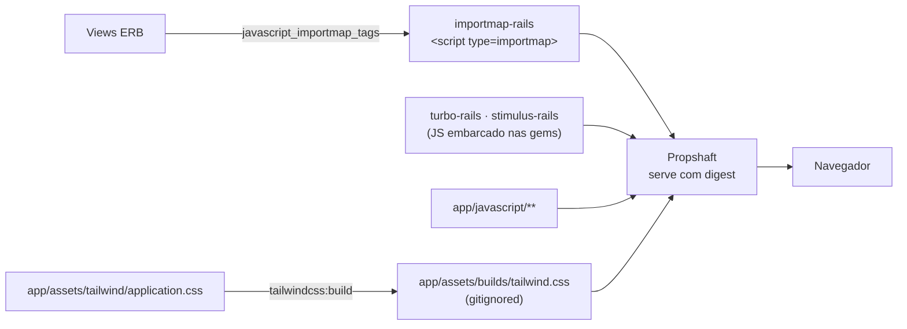
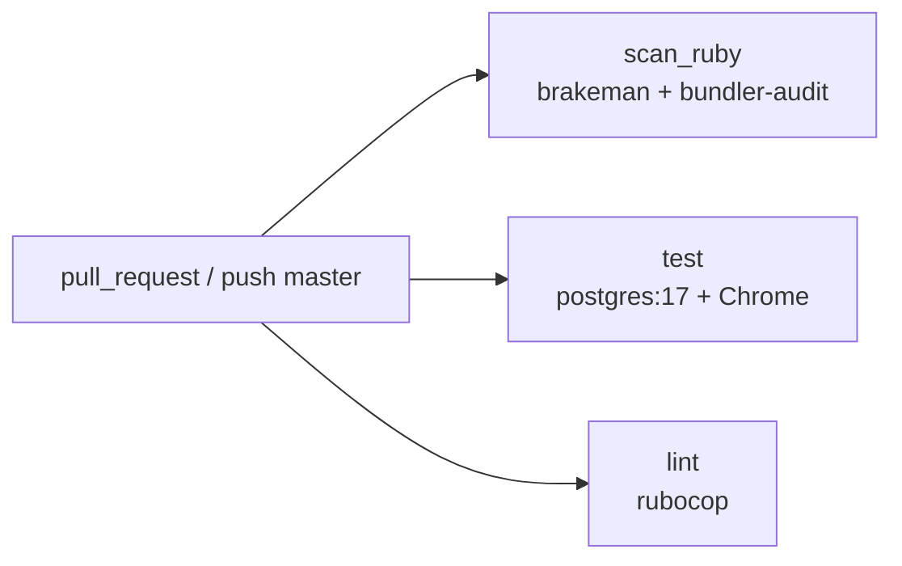
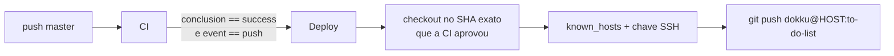

# Stack

Inventário técnico do projeto: **o que está instalado, em que versão, para que
serve, e por que essa peça e não outra.**

Este documento é o "de que é feito". O "como está montado" (camadas, modelo de
dados, invariantes de autorização) fica em [`ARQUITETURA.md`](ARQUITETURA.md); o
que ainda está em aberto em segurança fica em [`SEGURANCA.md`](SEGURANCA.md); as
regras de trabalho no dia a dia ficam em [`../CLAUDE.md`](../CLAUDE.md).

Versões conferidas no `Gemfile.lock`, no `compose.yaml` e nos workflows.
Ao atualizar uma dependência, atualize a linha correspondente aqui.

---

## 1. Visão geral em uma tabela

| Camada | Escolha | Versão | Papel |
|---|---|---|---|
| Linguagem | Ruby | 3.4.9 | Runtime da aplicação |
| Framework | Rails | 8.1.3 | Monólito full-stack (`api_only = false`) |
| Banco | PostgreSQL | 17-alpine | Persistência |
| Driver | `pg` | 1.6.3 | Adaptador Active Record ↔ Postgres |
| Servidor (dev) | Puma | 8.0.2 | HTTP em `:3000` |
| Servidor (prod) | Thruster + Puma | 0.1.23 | Cache/compressão de assets, X-Sendfile, TLS na borda |
| Senhas | `bcrypt` | 3.1.22 | `has_secure_password` |
| Assets | Propshaft | 1.3.2 | Pipeline sem Sprockets, sem transpilação |
| JS | importmap-rails | 2.2.3 | ES modules nativos, sem bundler e sem Node |
| Interatividade | Turbo | 2.0.23 | Navegação e formulários sem SPA |
| Comportamento | Stimulus | 1.3.4 | Um controller: o `<dialog>` de criação |
| CSS | Tailwind CSS | 4.6.0 (`tailwindcss-ruby` 4.3.3) | Utilitários + camada de componentes |
| Testes | RSpec Rails | 8.0.4 | Framework da suíte |
| Fixtures | FactoryBot / Faker | 6.5.1 / 3.8.0 | Dados de teste |
| Matchers | Shoulda Matchers | 6.5.0 | Validações e associações em uma linha |
| Cobertura | SimpleCov | 1.0.2 | `coverage/index.html` |
| Browser | Capybara + Cuprite (Ferrum) | 3.40 / 0.17 | Chrome headless real via CDP |
| Lint | RuboCop rails-omakase | 1.1.0 | Estilo |
| SAST | Brakeman | 8.0.5 | Análise estática de segurança |
| Cadeia | bundler-audit | 0.9.3 | CVEs conhecidas nas gems |
| Infra | Docker Compose | — | Ambiente reprodutível |
| CI/CD | GitHub Actions → Dokku | — | Testes, lint, scan e deploy |

Tudo o que **não** está na lista também é decisão: sem Node, sem `package.json`,
sem Redis, sem Sidekiq/Solid Queue, sem Kamal, sem JWT, sem SPA. Ver seção 10.

---

## 2. Runtime: Ruby e Rails

`.ruby-version` fixa **3.4.9**, e o mesmo número é o `ARG RUBY_VERSION` dos dois
Dockerfiles. Manter os três em sincronia importa: o `ruby/setup-ruby` da CI lê o
`.ruby-version`, então uma divergência faz a CI testar num Ruby diferente do que
roda em produção.

Rails **8.1.3** com `config.load_defaults 8.1`. Os railties carregados em
`config/application.rb`:

| Framework | Situação |
|---|---|
| Action Controller, Action View, Active Record, Active Model, Active Support | Em uso pesado |
| Active Job | Carregado, adapter padrão (`:async`) — nenhum job definido em `app/jobs/` além do `ApplicationJob` |
| Action Mailer | Carregado, nenhum mailer real ainda |
| Active Storage, Action Text, Action Mailbox, Action Cable | Carregados por padrão do gerador, **sem uso** |

O `image_processing` (1.14) existe no `Gemfile` por causa do Active Storage e,
na prática, não é exercitado por nenhum código nosso. É gordura do gerador —
remover é seguro, mas exige `bundle install` e rebuild da imagem, então fica
registrado aqui em vez de removido em silêncio.

**`config.api_only = false`** é a linha mais importante do arquivo. Ela restaura
o middleware de cookies, sessão e flash — e, com ele, a proteção CSRF, que é a
defesa principal agora que a autenticação anda em cookie. O histórico dessa
decisão (o projeto já foi API-only com JWT) está na seção 1 de
[`ARQUITETURA.md`](ARQUITETURA.md).

Geradores configurados para RSpec, sem fixtures e sem helpers:

```ruby
config.generators do |g|
  g.test_framework :rspec, fixture: false
  g.helper false
end
```

---

## 3. Persistência

**PostgreSQL 17-alpine**, em container. Motivo documentado: o Postgres nativo da
máquina de desenvolvimento tinha senha desconhecida e `scram-sha-256` em todas as
conexões; no container a senha é *definida* por nós no `.env` em vez de
descoberta. A porta publicada no host é **5433** para não colidir com a
instalação nativa.

O `compose.yaml` tem um healthcheck com `pg_isready`, e o serviço `app` declara
`depends_on: { db: { condition: service_healthy } }` — a aplicação só sobe depois
que o banco aceita conexão de verdade, não apenas quando o container existe.

### Configuração por variáveis discretas

`config/database.yml` lê `DB_HOST`, `DB_PORT`, `DB_USERNAME`, `DB_PASSWORD` e um
nome de banco por ambiente (`DB_NAME_DEVELOPMENT`, `DB_NAME_TEST`,
`DB_NAME_PRODUCTION`).

> **Nunca use `DATABASE_URL` neste projeto.** O Rails mescla `DATABASE_URL` sobre
> a configuração do **ambiente atual**. Com ela definida, rodar a suíte faria o
> ambiente de teste apontar para o banco de desenvolvimento — e o
> `db:test:prepare` o apagaria. A mesma regra vale na CI, e por isso o
> `ci.yml` também usa variáveis discretas.

Pool: `pool` sai de `RAILS_MAX_THREADS` (default 5). A chave já se chamou
`max_connections`, que o Active Record **ignora** — caía no padrão 5 sem que
ninguém percebesse.

Três migrations, nada de multi-database: `users`, `lists`, `tasks`. O schema e os
índices (incluindo o índice funcional em `lower(username)`) estão detalhados na
seção 3 de [`ARQUITETURA.md`](ARQUITETURA.md).

---

## 4. Servidor HTTP

**Puma 8.0.2** em desenvolvimento e teste, na porta 3000.

**Thruster 0.1.23** na frente do Puma em produção (`CMD ["./bin/thrust",
"./bin/rails", "server"]`, `EXPOSE 80`). O Thruster é um proxy Go que adiciona
cache e compressão de assets HTTP e aceleração X-Sendfile — coisas que o Puma
sozinho não faz bem. Não há Nginx no caminho.

Em produção, `config.assume_ssl = true` e `config.force_ssl = true`: o TLS é
terminado pelo proxy do Dokku, e o Rails responde com HSTS e cookies `secure`.

---

## 5. Autenticação

`bcrypt` 3.1.22 via `has_secure_password`. Sem gem de autenticação (Devise,
Sorcery, `authentication-zero`): são quatro ações de controller e o Rails já traz
`has_secure_password`, `reset_session` e o cookie assinado — uma dependência a
mais aqui só adicionaria superfície e configuração.

O cookie de sessão é assinado e criptografado por `SECRET_KEY_BASE`, `httponly`,
`samesite=lax` e `secure` em produção (`config/initializers/session_store.rb`).
Trocar `SECRET_KEY_BASE` desloga todo mundo.

A sessão **expira em 2 semanas**, em duas camadas. O `expire_after` do cookie
store não é só uma dica ao navegador: o Rails embute a expiração dentro do
cookie assinado, então o servidor recusa o cookie vencido mesmo que o cliente
ignore o atributo `Expires`. Além dele, `SessionManagement` carimba
`session[:created_at]` e confere a cada requisição — defesa em profundidade, que
passa a valer no dia em que alguém remover o `expire_after` ou trocar o store.

As garantias em volta disso — `reset_session` antes de gravar o `user_id`,
paridade de tempo de bcrypt no e-mail inexistente, 404 em vez de 403 — são
invariantes de segurança e estão na seção 5 de
[`ARQUITETURA.md`](ARQUITETURA.md), cada uma com spec dedicado.

---

## 6. Front-end

A stack de front-end deste projeto tem uma propriedade que vale enunciar:
**não existe Node.js em lugar nenhum.** Não há `package.json`, `node_modules`,
webpack, esbuild nem etapa de transpilação. O navegador recebe exatamente os
arquivos que estão no repositório.



### Propshaft

Pipeline de assets do Rails 8: serve arquivos com digest no nome e reescreve
referências. Não compila, não concatena, não minifica — porque nada aqui precisa
disso.

### importmap-rails

`config/importmap.rb` tem cinco linhas. `turbo.min.js` e `stimulus.min.js` vêm
embarcados nas próprias gems (`vendor/javascript/` está vazio — nada baixado da
internet no build), e `pin_all_from "app/javascript/controllers"` expõe os
Stimulus controllers como módulos ES nativos.

### Turbo 2.0.23

Dá navegação e submissão de formulários sem recarregar a página. Duas
consequências que aparecem em teste e em código:

- **Formulário vai por `fetch`.** Não existe navegação para o Capybara esperar,
  então `expect { click_button }.to change(Model, :count)` é flaky por
  construção. Sincronize primeiro numa asserção de tela. Ver `CLAUDE.md`.
- **Prefetch está desligado** (`data-turbo-prefetch="false"` no `<body>`), com um
  guard de servidor como defesa em profundidade. O porquê completo está na seção
  5.5 de [`ARQUITETURA.md`](ARQUITETURA.md) — não reative sem lê-la.

### Stimulus 1.3.4

Dois controllers:

- **`dialog_controller.js`** — abre e fecha o `<dialog>` nativo de criação.
  Reabre o popup sozinho quando a validação falha (`data-dialog-open-value`),
  senão o erro e o que a pessoa digitou sumiriam junto com o popup fechado.
- **`autosubmit_controller.js`** — envia o formulário quando o checkbox de
  "concluída" muda. Existe para tirar o `onchange="..."` inline das views:
  handler inline exige `'unsafe-inline'` em `script-src`, e essa única palavra
  esvaziaria a CSP inteira.

`eagerLoadControllersFrom` registra os dois sozinho; não há nada a declarar.

### Tailwind CSS 4.6.0

Via `tailwindcss-rails`, que usa o binário standalone do `tailwindcss-ruby` —
de novo, sem Node. O CSS é escrito em `app/assets/tailwind/application.css` (475
linhas) e compilado para `app/assets/builds/tailwind.css`, que é **gitignored**.

> Num clone novo, `bin/rails tailwindcss:build` não é opcional: sem ele a
> aplicação sobe sem estilo nenhum. Repita o comando sempre que mexer no CSS ou
> usar uma classe nova numa view — **o container roda só o servidor, não há
> watcher.** (`Procfile.dev` tem um `tailwindcss:watch`, mas o compose não o
> usa.)

O CSS está organizado em três blocos:

**1. Tokens semânticos** (`@theme inline`). As views nunca citam uma cor literal
(`slate-500`, `indigo-600`); citam um papel (`fg-muted`, `accent`,
`danger-subtle`). O `inline` faz o Tailwind escrever `var(--fg-muted)` dentro da
utility em vez de copiar o valor — sem ele a cor seria congelada no build e o
tema escuro não teria efeito nenhum.

**2. Tema claro e escuro.** Só CSS, via `@media (prefers-color-scheme: dark)`:
sem JS, sem toggle, sem persistência. O Cuprite roda em `light` por padrão, então
a suíte continua exercitando o tema claro.

**3. Camada de componentes** (`@layer components`): `.page`, `.card`, `.row`,
`.btn` + variantes (`primary`/`secondary`/`ghost`/`danger`/`sm`), `.field`,
`.checkbox`, `.badge`, `.progress`, `.alert`, `.modal-panel`, `.skip-link`.
As views usam essas classes em vez de repetir a sopa de utilitários.

Duas armadilhas já pagas:

- **`.modal-panel` precisa de `m-auto`.** O preflight do Tailwind zera a margem
  de tudo, inclusive o `margin: auto` que o navegador usa para centralizar um
  `<dialog>` modal.
- **Fonte é stack do sistema, nenhuma webfont externa.** O container não tem rede
  garantida, e a CSP (V-02, já aplicada) bloquearia o CDN. Os nomes concretos
  vêm **antes** de `ui-sans-serif`/`system-ui`: o Chrome considera essas duas
  palavras-chave sempre disponíveis, então a lista nunca alcançaria os nomes
  seguintes e, num ambiente sem fonte de UI definida, cairia numa monoespaçada.

### Ícones

`app/views/shared/_icon.html.erb` concentra todos os SVGs da aplicação, com
locais `name`, `class` e `stroke_width`. Markup literal, **nunca `raw`/
`html_safe`** — "zero `html_safe` em `app/`" é invariante registrada em
`SEGURANCA.md`. Todos os ícones são decorativos (`aria-hidden="true"`); quem
precisar de nome acessível passa um `<span class="sr-only">`.

---

## 7. Testes

TDD é obrigatório: nada em `app/` sem um teste falhando antes.

| Gem | Versão | Papel |
|---|---|---|
| `rspec-rails` | 8.0.4 | Framework |
| `factory_bot_rails` | 6.5.1 | Factories (`create(:user)` direto, via `FactoryBot::Syntax::Methods`) |
| `faker` | 3.8.0 | Dados variados nas factories |
| `shoulda-matchers` | 6.5.0 | `validate_presence_of`, `belong_to` etc. |
| `simplecov` | 1.0.2 | Cobertura em `coverage/index.html` |
| `capybara` | 3.40.0 | DSL de navegador |
| `cuprite` | 0.17 (Ferrum 0.17.2) | Driver CDP — Chrome headless **de verdade**, sem Selenium e sem chromedriver |

Estado atual: **143 exemplos, 96.36% de cobertura**.

### Configuração que não é óbvia

**`spec/rails_helper.rb` força `ENV['RAILS_ENV'] = 'test'` com atribuição
incondicional.** Com `||=`, o `RAILS_ENV=development` definido pelo container
venceria e a suíte rodaria contra o banco de desenvolvimento — apagando-o.

**As opções do Cuprite vão no `driven_by(options:)`, não em
`Capybara.register_driver`.** No Rails 8.1 o `:cuprite` entrou na lista
`registerable?` do `ActionDispatch::SystemTesting::Driver`, então o `driven_by`
re-registra o driver do zero e descarta qualquer registro manual. O
`spec/support/capybara.rb` existe justamente para carregar o Capybara e deixar
esse aviso escrito.

**`--no-sandbox` é obrigatório.** Sem ele o Chrome não sobe como root dentro do
container e o Ferrum falha com "Browser did not produce websocket url". Vão
junto `--disable-dev-shm-usage` e `--disable-gpu`.

**O binário do navegador vem de `BROWSER_PATH`**, que muda de ambiente:
`/usr/bin/chromium` no container (`Dockerfile.dev`), `/usr/bin/google-chrome` no
runner do GitHub (`ci.yml`).

`use_transactional_fixtures = true`; `Capybara.default_max_wait_time = 5`.

### Onde cada tipo de teste mora

| Camada | Arquivos | Prova |
|---|---|---|
| Model | `spec/models/` | Validações, associações, defaults, normalização, ausência de `user_id` em `tasks` |
| Sistema | `spec/system/` | Fluxos de usuário no Chrome headless |
| Request | `spec/requests/authorization_spec.rb` | Cenários que um navegador **não produz**: forjar `user_id`/`list_id`/`role` no corpo, indistinguibilidade 404, paridade de tempo no login, CSRF |
| Request | `spec/requests/flash_spec.rb` | Prefetch não consome nem sobrescreve a sessão, e não desliga o `Set-Cookie` fora de GET/HEAD |
| Request | `spec/requests/rate_limit_spec.rb` | Limite por IP em login e cadastro, idêntico para e-mail existente e inexistente |
| Request | `spec/requests/session_expiration_spec.rb` | As duas camadas de expiração, cada uma isolada da outra |
| Request | `spec/requests/content_security_policy_spec.rb` | CSP sem `unsafe-inline` e nonce que não quebra a igualdade byte a byte das respostas |
| Request | `spec/requests/permissions_policy_spec.rb` | `Permissions-Policy` negando os recursos não usados |
| Request | `spec/requests/signup_race_spec.rb` | Corrida de unicidade vira 422, não 500 |

A justificativa de por que os testes de segurança não são de sistema está na
seção 8 de [`ARQUITETURA.md`](ARQUITETURA.md).

> **A saída do `rspec` fica bufferizada** quando o comando roda pelo PowerShell.
> Para acompanhar ao vivo, redirecione para um arquivo no bind mount
> (`... > /rails/suite.log 2>&1`) e leia o arquivo pelo host.

---

## 8. Qualidade e segurança da cadeia

| Ferramenta | O que faz | Onde roda |
|---|---|---|
| `rubocop-rails-omakase` 1.1.0 | Estilo (herda `rubocop.yml` da gem; `.rubocop.yml` local não sobrescreve nada) | Job `lint`, com cache em `tmp/rubocop` |
| `brakeman` 8.0.5 | SAST específico de Rails: SQL injection, mass assignment, redirect aberto, XSS | Job `scan_ruby` |
| `bundler-audit` 0.9.3 | CVEs conhecidas nas gems do `Gemfile.lock` | Job `scan_ruby` |
| Dependabot | PRs semanais para `bundler` e `github-actions` (limite 10 cada) | `.github/dependabot.yml` |

---

## 9. Infraestrutura e deploy

### 9.1 Desenvolvimento — Docker Compose

Dois serviços (`db`, `app`) e três volumes nomeados (`pgdata`, `tmp`, `log`).

O código é bind-mounted em `/rails`, mas `tmp/` e `log/` são **volumes nomeados
sobrepostos ao bind mount**: eles vivem no filesystem do container em vez de no
OneDrive, o que evita I/O lento e sincronização de lixo.

> **Não monte volume nomeado em `/usr/local/bundle`.** Ele sombrearia as gems da
> imagem, e um `docker compose build` depois de mexer no `Gemfile` não teria
> efeito nenhum.

`Dockerfile.dev` parte de `ruby:3.4.9-slim` e instala `build-essential`,
`libpq-dev`, `libyaml-dev`, `postgresql-client`, **`chromium`** e
`fonts-liberation`. `BUNDLE_WITHOUT=""` é vazio de propósito: precisamos dos
grupos `development` e `test`. O `Gemfile`/`Gemfile.lock` são copiados **antes**
do código, para que uma mudança em `app/` não invalide a camada do
`bundle install`.

### 9.2 Produção — `Dockerfile` multi-stage

Estágio `base` (runtime enxuto: `curl`, `libjemalloc2`, `libvips`,
`postgresql-client`) → estágio `build` (toolchain + `bundle install` +
`assets:precompile`) → imagem final, que copia só os artefatos.

Detalhes deliberados:

- **jemalloc via `LD_PRELOAD`** — menos fragmentação de memória no Ruby.
- **Usuário não-root** (`rails`, uid/gid 1000).
- **`BUNDLE_WITHOUT="development"`**, `BUNDLE_DEPLOYMENT=1`.
- **Sem `bootsnap precompile`**: o bootsnap foi removido do `Gemfile` de
  propósito — seu cache nativo não abre arquivos sob um caminho com acento
  (`Área de Trabalho`) no Windows e quebra o boot.
- **Correção dos binstubs no build**: `chmod +x`, remoção de CRLF e
  `s/ruby\.exe$/ruby/`. Binstubs gerados no Windows saem apontando para
  `ruby.exe`, que não existe no container Linux.
- **`SECRET_KEY_BASE_DUMMY=1`** só para o boot durante o `assets:precompile`; o
  valor real vem do ambiente em produção.

### 9.3 CI — `.github/workflows/ci.yml`

Dispara em `pull_request` e em `push` para `master`. Três jobs paralelos:



O job `test` sobe um `postgres:17-alpine` como service (usuário/senha fixos, sem
secret — o serviço só existe dentro da rede daquela execução), instala
`google-chrome-stable`, roda `db:test:prepare`, **`tailwindcss:build`** (sem ele
o Propshaft não acha o `tailwind` do layout e todo spec de sistema quebra) e por
fim `bundle exec rspec`. Em caso de falha, os screenshots de
`tmp/screenshots` sobem como artifact.

> O nome do job `test` é o nome do status check exigido na proteção de branch.
> Renomear aqui sem renomear lá trava o PR esperando um check que nunca chega —
> ou, pior, libera o merge por não exigir nada.

### 9.4 CD — `.github/workflows/cd_main.yml`

Deploy em **Dokku**, por `git push`. O gatilho não é `push`: é a **conclusão bem
sucedida do workflow CI na master** (`workflow_run`), então nada é publicado sem
passar pela CI.



Quatro cuidados embutidos:

- **`concurrency: deploy-production`** com `cancel-in-progress: false` — dois
  deploys não disputam o servidor.
- **Checkout no `workflow_run.head_sha`**, não no HEAD da branch: em
  `workflow_run` o padrão traria a branch já avançada, publicando um commit
  diferente do que a CI testou.
- **`fetch-depth: 0`** — o Dokku recebe um push de git, não um tarball.
- **Host key SSH obrigatória.** O secret `DOKKU_HOST_KEY` é exigido; não há mais
  fallback para `ssh-keyscan`, que era trust-on-first-use a *cada* execução e
  deixava quem estivesse na rede do runner receber o push com o código-fonte
  inteiro (V-09). Um `ssh-keygen -F` ainda confirma que o `known_hosts` cobre o
  host, falhando com mensagem acionável em vez de estourar depois como "Host key
  verification failed".
- **Actions fixadas por SHA** e `permissions: contents: read` nos dois workflows
  (V-08).
- **Push sem `--force`.** Rejeição por não-fast-forward é sinal de histórico
  reescrito — investigue em vez de forçar.

### 9.5 Segredos

`.env` (não versionado) guarda `POSTGRES_PASSWORD` e `SECRET_KEY_BASE`, ambos
gerados aleatoriamente. `.env.example` é o modelo versionado — mantenha os dois
em sincronia. `config/master.key` fica fora da imagem pelo `.dockerignore`, e por
isso o `SECRET_KEY_BASE` é passado explicitamente pelo compose: sem ele o Rails
geraria um segredo efêmero em `tmp/` a cada rebuild.

Nenhuma credencial em arquivo versionado, em nenhum ambiente.

---

## 10. O que foi deixado de fora, e por quê

| Ausente | Motivo |
|---|---|
| Node.js, `package.json`, bundler JS | importmap + Propshaft + binário standalone do Tailwind cobrem tudo. Zero build de front-end |
| SPA (React/Vue) + API JSON | Nenhum consumidor fora do navegador. Ver seção 1 de `ARQUITETURA.md` |
| JWT | A autenticação anda em cookie `httponly`: não é roubável por XSS e o logout é imediato no navegador do usuário |
| Devise / gem de auth | Quatro ações de controller; `has_secure_password` já resolve |
| Redis, Sidekiq, Solid Queue/Cache/Cable | Não há job nem WebSocket. Cache é `:memory_store` nos três ambientes — em teste porque o `rate_limit` conta ali (com `:null_store` o contador nunca subiria), em produção porque hoje é um processo Puma só. **Escalar para vários workers exige um store compartilhado**, senão o limite efetivo vira N × 10 |
| Kamal | O deploy é `git push` para Dokku; o Dokku faz o build |
| `bootsnap` | Removido de propósito: o cache nativo não abre caminho com acento no Windows e quebra o boot |
| `rack-cors`, `jbuilder` | Herdados comentados do gerador; sem API JSON, não têm função |
| Nginx | O Thruster já faz cache/compressão de assets; o TLS é terminado pelo Dokku |

---

## 11. Manutenção da stack

```bash
# Depois de mexer no Gemfile
docker compose build app

# Depois de mexer no CSS ou usar classe nova numa view
docker compose run --rm app bin/rails tailwindcss:build

# Atualizar gems (Dependabot já abre PR semanal)
docker compose run --rm app bundle update <gem>
docker compose run --rm app bundle exec rspec
docker compose run --rm app bundle exec rubocop
```

Subir de versão maior de Ruby exige mudar **três** lugares: `.ruby-version`,
`ARG RUBY_VERSION` do `Dockerfile` e do `Dockerfile.dev`.

Subir Rails ou Postgres de versão maior: atualize também a tabela da seção 1
deste documento e a seção 9 de [`ARQUITETURA.md`](ARQUITETURA.md).
